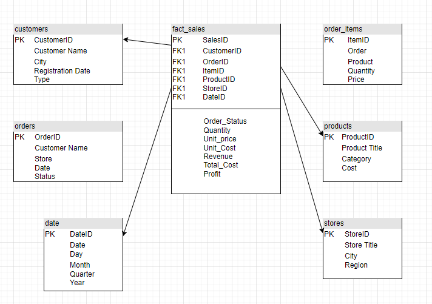
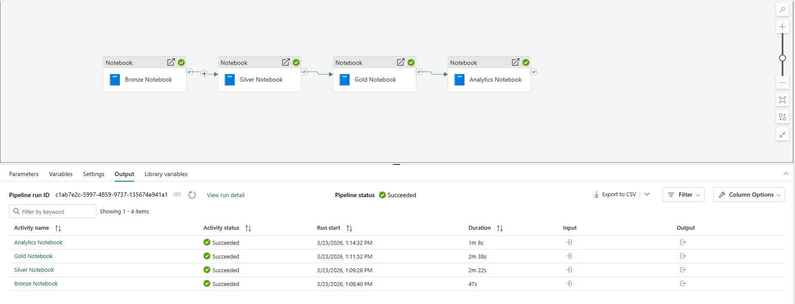
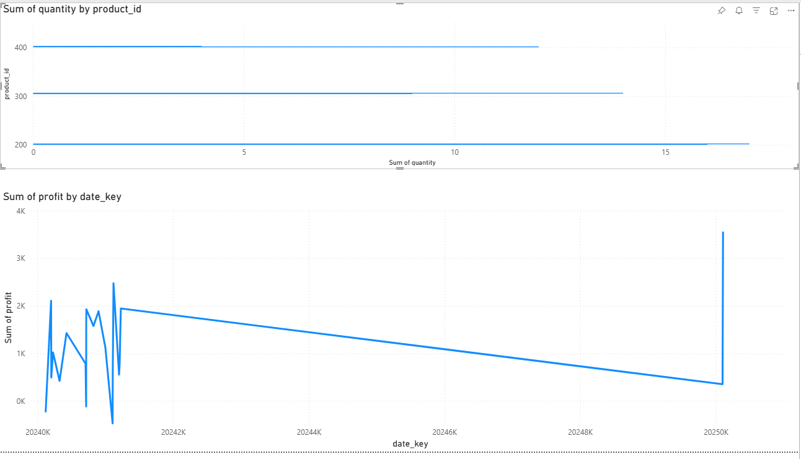

# sales-data-pipeline  
Data Engineering Project – End-to-End Sales Analytics Pipeline (Microsoft Fabric)

This project demonstrates a complete data engineering and analytics pipeline built on Microsoft Fabric. It processes raw retail sales data into a structured star schema and enables business insights through Power BI dashboards.

---

## Project Overview

- End-to-end ETL pipeline for retail sales data  
- Implementation of Medallion Architecture (Bronze → Silver → Gold)  
- Creation of a Star Schema (Fact + Dimension Tables)  
- Automated execution using Microsoft Fabric Data Factory  
- Advanced analytics using SQL (window functions, joins, aggregations)  
- Integration with Power BI for visualization and reporting  

---

## Folder Structure

```
├── notebooks/
│ ├── bronze_layer.ipynb
│ ├── silver_layer.ipynb
│ ├── gold_layer.ipynb
│ └── analytics_layer.ipynb
│
├── data/
│ ├── bronze/
│ ├── silver/
│ └── gold/
│
├── powerbi/
│ └── dashboard_preview.png
│
├── data_factory_pipeline.png
├── star_schema.png
└── README.md                      
```

---

## Architecture and Data Flow

The project follows a Medallion Architecture:

### Bronze Layer – Raw Ingestion

- Source: CSV files (customers, orders, products, stores, order_items)  
- Stores raw data without transformation  
- Handles ingestion into the lakehouse  

---

### Silver Layer – Data Cleaning and Transformation

- Data cleaning:
  - Removes invalid rows (e.g., missing IDs, invalid quantities)  
  - Standardizes formats (dates, text fields)  
  - Filters invalid business cases (e.g., type = unknown)  

- Output tables:
  - slv_customers  
  - slv_products  
  - slv_stores  
  - slv_orders  
  - slv_order_items  

---

### Gold Layer – Star Schema Modeling

The cleaned data is transformed into a star schema optimized for analytics.

Fact Table:
- fact_sales  
  - revenue, quantity, profit, cost  
  - foreign keys to dimensions  

Dimension Tables:
- dim_customer  
- dim_product  
- dim_store  
- dim_date  

This structure enables efficient aggregation and filtering in BI tools.

---

## Star Schema Overview



---

## Automation with Microsoft Fabric

The pipeline is orchestrated using Microsoft Fabric Data Factory. The notebooks are executed in sequence:

1. Bronze Notebook  
2. Silver Notebook  
3. Gold Notebook  
4. Analytics Notebook  

---

## Pipeline Execution



---

## Analytics Layer

Several business questions are answered using SQL:

- Top 5 products by revenue per region (latest quarter)  
- Customer segmentation (High / Mid / Low value using NTILE)  
- Frequently bought product pairs  
- Share of customers ordering in multiple quarters  

---

## Power BI Integration

The Gold Layer is connected to Power BI via the SQL Analytics Endpoint.

Modeling approach:
- fact_sales provides measures (revenue, profit, quantity)  
- dimension tables provide slicing (region, product, date, customer)  

Relationships:
- fact_sales.customer_id → dim_customer.customer_id  
- fact_sales.product_id → dim_product.product_id  
- fact_sales.store_id → dim_store.store_id  
- fact_sales.date_key → dim_date.date_key  

---

## Example Dashboard




---

## Setup Notes

- The project runs entirely inside Microsoft Fabric  
- Uses Lakehouse storage and Delta tables  
- Orchestrated with Data Factory pipelines  
- Power BI connects directly via SQL endpoint  
